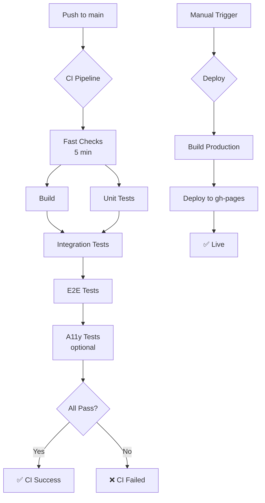

# GitHub Actions Workflows

**Production-Ready CI/CD Pipeline für Solo Developer**

Optimiert nach Best Practices 2025 mit Fokus auf:
- **Fast Feedback Loop**: Schnelle Tests zuerst, langsame später
- **Resource Efficiency**: Parallele Ausführung, Smart Caching
- **No Infinite Loops**: GITHUB_TOKEN + [skip ci] Pattern
- **Local-First**: Pre-push Hook verhindert CI-Failures

---

## Workflows

### 1. CI Pipeline (`ci.yml`)

**Trigger:** Push/PR auf `main` Branch

**Pipeline Stages:**

```
Stage 1: Fast Checks (5 min)
└── Lint & TypeCheck (fail fast)

Stage 2: Build & Unit Tests (Parallel, 10 min)
├── Build → dist artifacts
└── Unit Tests → Coverage

Stage 3: Integration Tests (15 min)
└── Integration Tests (Chromium)

Stage 4: E2E Tests (20 min)
└── E2E Tests (Chromium only)

Stage 5: Specialized Tests (Parallel, optional)
└── Accessibility Tests (can fail without blocking)

Final Gate: CI Success
└── All required checks must pass
```

**Features:**
- ✅ Fail-Fast: Lint/TypeCheck first
- ✅ Parallel Execution: Build + Unit Tests gleichzeitig
- ✅ Smart Caching: pnpm dependencies cached
- ✅ Chromium Only: Schneller als Multi-Browser
- ✅ Timeout Protection: Alle Jobs mit Timeouts
- ✅ Artifact Upload: Nur bei Failures
- ✅ Concurrency: Cancel in-progress runs

**Resourcen-Optimierung:**
- Keine redundanten Tests (bereits durch pre-push hook lokal)
- Nur Chromium statt 3 Browser = 60% schneller
- Upload nur bei Failures = weniger Storage
- retention-days: 1-14 Tage statt default 90

---

### 2. Deploy Pipeline (`deploy.yml`)

**Trigger:** Nur manuell via `workflow_dispatch`

**Pipeline:**

```
Deploy (10 min)
├── Checkout
├── Install Dependencies (cached)
├── Build Production
└── Deploy to GitHub Pages (gh-pages branch)
```

**Features:**
- ✅ Manual Only: Kontrolliertes Deployment
- ✅ No Tests: Vertrauen in CI + pre-push hook
- ✅ [skip ci] Tag: Verhindert Endlosschleifen
- ✅ keep_files: Erhält trainingsplan.json
- ✅ Deployment Summary: Direktes Feedback im UI
- ✅ Concurrency Protection: Keine parallelen Deployments

**Anti-Loop Mechanismus:**
```yaml
commit_message: 'deploy: ${{ github.sha }} [skip ci]'
github_token: ${{ secrets.GITHUB_TOKEN }}  # nicht PAT!
```

---

## Best Practices umgesetzt

### 1. Prevent Infinite Loops ✅
- GITHUB_TOKEN statt Personal Access Token
- [skip ci] in commit messages
- No push triggers auf gh-pages

### 2. Fast Feedback ✅
- Fail-Fast: Lint/TypeCheck vor allen anderen
- Parallel Jobs wo möglich
- Chromium-only für Speed

### 3. Resource Efficiency ✅
- Smart Dependency Caching (pnpm)
- Kurze Artifact Retention (1-14 Tage)
- Upload nur bei Failures
- Timeouts für alle Jobs

### 4. Local-First Development ✅
```bash
# Pre-push Hook (.husky/pre-push)
├── TypeScript Check
├── Unit Tests
└── Infrastructure Tests
```
→ CI läuft nur bei erfolgreichen lokalen Tests

### 5. Solo Developer Optimierungen ✅
- Kein Matrix Build (1 Browser statt 3)
- Keine Cross-Platform Tests (Linux only)
- Manual Deployment (kein Auto-Deploy)
- Minimal aber vollständig

---

## Verwendung

### CI Pipeline
```bash
# Automatisch bei Push auf main
git push origin main

# Tests laufen bereits lokal via pre-push hook
# CI = Final validation + Integration/E2E Tests
```

### Deployment
```bash
# GitHub UI: Actions → Deploy → Run workflow
# Oder via CLI:
gh workflow run deploy.yml
```

### Monitoring
```bash
# Aktuelle Workflows
gh run list

# Workflow Status
gh run view

# Logs anzeigen
gh run view --log
```

---

## Entfernte redundante Workflows

- ❌ `tests.yml` - Komplett redundant zu `ci.yml`
- ❌ `visual-regression.yml` - Nicht aktiv genutzt

**Konsolidierung = Einfachheit = Wartbarkeit**

---

## Pipeline-Diagramm



---

## Troubleshooting

### Problem: Zu viele Actions laufen
**Lösung:**
- Push nur auf `main` branch
- PRs in eigenen Branches
- Nutze `concurrency` um alte Runs zu canceln

### Problem: Deployment Loop
**Lösung:**
- Verwende `GITHUB_TOKEN` (nicht PAT)
- Checke `[skip ci]` im commit message
- Nur manual trigger für deploy

### Problem: Tests zu langsam
**Lösung:**
- Läuft bereits optimiert (Chromium only)
- Bei Bedarf: E2E Tests optional machen
- Oder: Weitere Tests in pre-push hook

---

## Metriken

**CI Pipeline:**
- ⏱️ Fast Checks: ~5 min
- ⏱️ Full Pipeline: ~20-30 min
- 💰 GitHub Actions Minutes: ~30-40 min/push

**Deploy Pipeline:**
- ⏱️ Build + Deploy: ~10 min
- 💰 GitHub Actions Minutes: ~10 min/deployment

**Gesamt (typischer Workflow):**
- 1 Push = 30-40 min CI
- 1 Deploy/Woche = 10 min
- **~120-200 min/Monat** bei aktivem Development
- Free Tier: 2000 min/Monat ✅

---

**Designed with ❤️ for Solo Developers**
